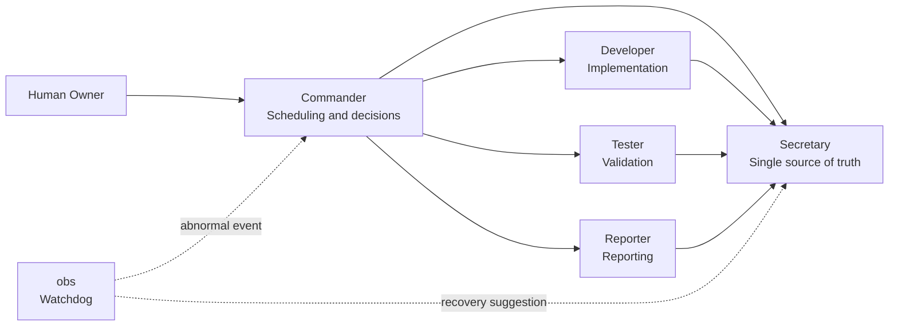
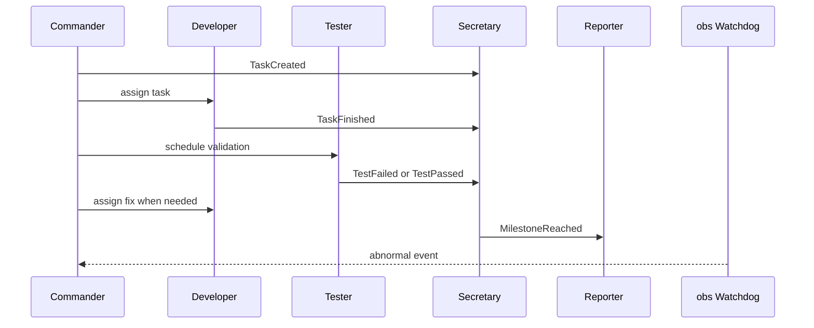

# CXWorkflow

[](#codex-plugin)
[](#event-driven-model)
[](#rate-limit-safety)
[](./README.md)

CXWorkflow is a multi-session Codex development workflow. It does not treat “more agents” as better; it uses minimum necessary concurrency to organize Codex into a predictable, recoverable, long-running development team.

> Core principle: CXWorkflow prioritizes deterministic coordination over maximum parallelism. Agents communicate through events, Secretary acts as the single source of truth, and Commander schedules work using a rate-limit-aware sequential handoff strategy.

## Quick Start

### Use As A Codex Plugin

1. Clone this repository.
2. Add this local plugin in the Codex plugin management UI. The plugin root is the repository root:

```text
<your-local-path>/CXWorkflow
```

3. Open a new Codex thread after installation so the plugin skill is loaded.
4. In the new thread, ask:

```text
Help me set up a CXWorkflow Codex development team for this project.
```

or:

```text
Create a CXWorkflow multi-session development team for the current project.
```

### Manual Use

If you do not want to install the plugin yet, copy the [one-click setup prompt](#one-click-setup-prompt) into Codex directly.

## Table Of Contents

- [Why CXWorkflow](#why-cxworkflow)
- [Architecture](#architecture)
- [Core Concepts](#core-concepts)
- [Team Roles](#team-roles)
- [Load Levels](#load-levels)
- [Rate Limit Safety](#rate-limit-safety)
- [Codex Plugin](#codex-plugin)
- [One-Click Setup Prompt](#one-click-setup-prompt)
- [When To Use](#when-to-use)

## Why CXWorkflow

A single Codex session works well for quick questions and small edits. In long-running projects, however, one session often ends up planning, implementing, testing, remembering decisions, and reporting progress at the same time. That creates crowded context, inconsistent state, and unnecessary request pressure.

CXWorkflow reduces coordination chaos:

| Common Trap | CXWorkflow Choice |
| --- | --- |
| More agents means smarter workflow | Minimum necessary concurrency |
| Sessions ask each other for state | Secretary as single source of truth |
| Every session runs at once | Commander schedules sequentially |
| obs polls constantly | obs sleeps as a Watchdog until abnormal events |
| Keep retrying after 429 | Circuit break, save state, downgrade, recover |

## Architecture



## Core Concepts

### Event-Driven Model

Roles respond to events instead of constantly polling each other.



| Event | Emitted By | Responds |
| --- | --- | --- |
| `TaskCreated` | Commander | Developer reads the task and executes |
| `TaskFinished` | Developer | Commander schedules Tester |
| `TestFailed` | Tester | Commander assigns Developer a fix |
| `Blocked` | Any session | Commander decides, Secretary records |
| `MilestoneReached` | Commander or Secretary | Reporter generates a report |
| `RateLimitWarning` | Any session | Commander lowers concurrency, obs enters Watchdog mode |

### Secretary Is The Single Source Of Truth

All important events, task states, blockers, test results, decisions, and recovery actions are written to Secretary. Any role that needs context reads Secretary first instead of asking another session directly.

### Commander Is The Only Scheduler

Commander decides who works and when. Developer and Tester use sequential handoff. Reporter and obs join only at milestones, blockers, or abnormal events.

### obs Is A Watchdog

obs sleeps during normal operation. It wakes when one of these events appears:

- No new event for too long
- Task is stuck or blocker is unhandled
- Repeated test failures
- 429 or request pressure
- Session role drift
- Context conflict or inconsistent state

## Team Roles

| Session | Role | Primary Responsibility |
| --- | --- | --- |
| `Commander` / `指挥` | Project lead | Breaks down goals, schedules sessions, defines priorities and acceptance criteria |
| `Secretary` / `秘书` | Single source of truth | Records events, task state, decisions, blockers, and recovery actions |
| `Developer` / `开发` | Main engineer | Implements features, fixes bugs, refactors code, and reports validation results |
| `Tester` / `测试` | QA and reviewer | Runs tests, reviews quality, and finds regression risks |
| `Reporter` / `汇报` | Status reporter | Produces progress reports at milestones or on request |
| `Observer` / `obs` | Watchdog | Detects abnormal workflow state and helps bring the team back on track |

## Load Levels

Start at Level 1 by default. Increase only when complexity, risk, or duration justifies it.

| Level | Active Roles | Use Case |
| --- | --- | --- |
| Level 0 | Commander | Clarification, lightweight planning, simple questions |
| Level 1 | Commander + Developer | Default mode for small implementation or fixes |
| Level 2 | Commander + Developer + Tester | Validation, regression checks, or code review |
| Level 3 | Commander + Secretary + Developer + Tester + Reporter + obs | Long-running projects, multi-module features, complex collaboration |

## Rate Limit Safety

CXWorkflow defaults to minimum necessary concurrency to reduce API 429 risk.

| Condition | Action |
| --- | --- |
| Normal operation | Sequential handoff; Reporter and obs do not poll |
| 1 consecutive `429` | Commander lowers load level and pauses non-essential sessions |
| 3 consecutive `429`s | Stop Reporter and obs; keep only Commander and essential execution |
| 5 consecutive `429`s | Secretary saves state, Commander pauses workflow, wait for cooldown |

Recovery flow:

1. Secretary reads the last known state.
2. Commander confirms the current task, blockers, and next step.
3. Resume from a lower load level instead of returning directly to all-role concurrency.

## Codex Plugin

This repository includes a Codex plugin configuration:

| Item | Path Or Value |
| --- | --- |
| Plugin manifest | `.codex-plugin/plugin.json` |
| Plugin name | `cxworkflow` |
| Display name | `CXWorkflow` |
| Category | `Productivity` |
| Skills directory | `skills/` |
| Workflow skill | `skills/cxworkflow/SKILL.md` |

After installation, Codex can discover the CXWorkflow skill and use it when a user wants to create, explain, or operate a multi-session development team.

## One-Click Setup Prompt

<details>
<summary>Show full prompt</summary>

```text
Please create a Codex multi-session development team for the current project. Every session should use the current repository as its working directory.

Create and name the following sessions:

1. Commander
Responsibility: You are the project lead. Read the whole project and existing context, understand the goal, break down tasks, define the development route, and assign work to the other sessions. Do not do large implementation work directly. Prioritize decisions, planning, coordination, and acceptance criteria.

2. Secretary
Responsibility: You are the project secretary and the single source of truth. Record decisions, task status, thread progress, todos, blockers, test results, and recovery actions. Any role that needs context should read your records first.

3. Developer
Responsibility: You are the main developer. Implement code changes, bug fixes, refactors, and features based on Commander instructions. Before each change, understand the code structure. After each change, run necessary validation and report results to Secretary and Commander.

4. Tester
Responsibility: You are the tester and code reviewer. Review code quality, run tests, find bugs, coverage gaps, architectural risks, and regression risks. Report issues to Secretary and Commander by severity.

5. Reporter
Responsibility: You are the progress reporter. Generate progress reports only at milestones, on user request, or when Commander asks. Read Secretary first and avoid frequent polling of other sessions.

6. obs
Responsibility: You are the Workflow Watchdog. Sleep during normal operation. When a session drops off, drifts from its role, misses important context, leaves blockers unhandled, repeatedly fails tests, hits 429, moves away from the project goal, or breaks collaboration flow, identify the issue, prompt the relevant session to resume its responsibility, and give Commander and Secretary concrete recovery suggestions so the team returns to a normal operating track.

After creation, list each session's threadId, title, and responsibility, and pin these sessions if possible.
```

</details>

Short version:

```text
Please create a Codex multi-session development team for the current project: Commander, Secretary, Developer, Tester, Reporter, and obs. Use event-driven coordination, Secretary as the single source of truth, Commander as the rate-limit-aware sequential scheduler, and obs as a Watchdog for abnormal recovery. After creation, list the threadId and purpose for each session, and pin them.
```

## Reporting Format

```md
# Project Status

## Completed
- ...

## In Progress
- ...

## Blocked
- ...

## Risks
- ...

## Next Steps
- ...
```

## When To Use

Use CXWorkflow when:

- The project will last more than one session.
- The work touches multiple modules or files.
- You need continuous planning, coding, testing, and reporting.
- You want Codex to behave more like a development team than a single assistant.
- You want to control multi-agent cost and 429 risk.

Avoid CXWorkflow for:

- Small one-file fixes.
- One-off simple questions.
- Tasks that do not need testing, reporting, or long-running context.
