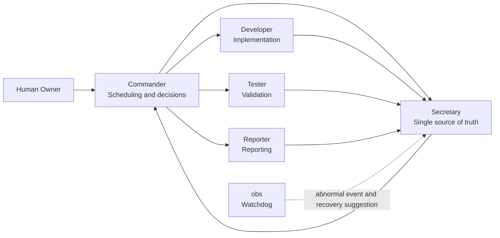
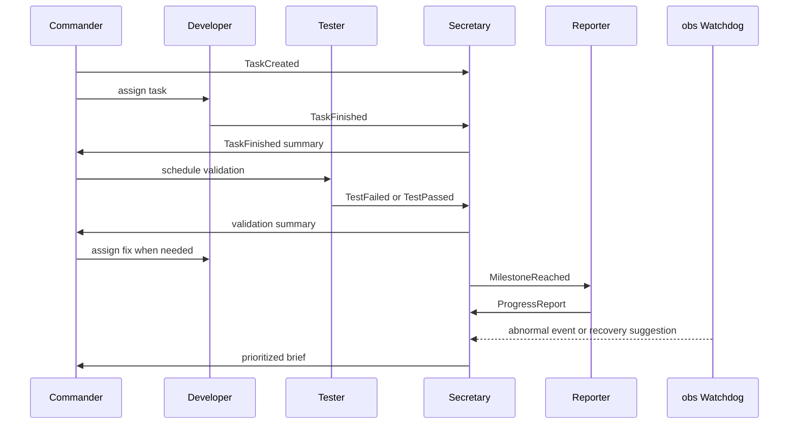

<h1 align="center">CXWorkflow</h1>

<div align="center">

[](#codex-plugin)
[](#event-driven-model)
[](#rate-limit-safety)
[](./CHANGELOG.md)
[](./README.md)

</div>

CXWorkflow is a multi-session Codex development workflow. It does not treat “more agents” as better; it uses minimum necessary concurrency to organize Codex into a predictable, recoverable, long-running development team.

> Core principle: CXWorkflow prioritizes deterministic coordination over maximum parallelism. Agents communicate through events, Secretary acts as the single source of truth and Commander inbox, and Commander only accepts summarized messages forwarded by Secretary while scheduling work using a rate-limit-aware sequential handoff strategy.

## Quick Start

### Use As A Codex Plugin

1. Clone this repository.
2. Add this local plugin in the Codex plugin management UI. The plugin root is the repository root:

```text
<your-local-path>/CXWorkflow
```

3. Open a new Codex thread after installation so the plugin skill is loaded.
4. In the new thread, ask:

```text
Help me set up a CXWorkflow Codex development team for this project.
```

or:

```text
Create a CXWorkflow multi-session development team for the current project.
```

### Manual Use

If you do not want to install the plugin yet, copy the [one-click setup prompt](#one-click-setup-prompt) into Codex directly.

## Table Of Contents

- [Prerequisites](#prerequisites)
- [Install And Update](#install-and-update)
- [Why CXWorkflow](#why-cxworkflow)
- [Architecture](#architecture)
- [Core Mechanisms](#core-mechanisms)
- [Secretary Routing Protocol](#secretary-routing-protocol)
- [Team Roles](#team-roles)
- [Load Levels](#load-levels)
- [Rate Limit Safety](#rate-limit-safety)
- [Codex Plugin](#codex-plugin)
- [One-Click Setup Prompt](#one-click-setup-prompt)
- [Reporting Format](#reporting-format)
- [Troubleshooting](#troubleshooting)
- [When To Use](#when-to-use)
- [Contributing and License](#contributing-and-license)

## Prerequisites

- **Codex access**: You need an active Codex account with session creation permissions.
- **Plugin support**: Your Codex client must support local plugin installation.
- **Network**: Ensure reliable access to the Codex API (avoid peak hours to reduce 429 risk).

## Install And Update

Use the repository update script so the personal marketplace, plugin source directory, and Codex cache stay aligned:

```powershell
powershell -ExecutionPolicy Bypass -File .\scripts\update-local-plugin.ps1
```

The script syncs the plugin to:

```text
%USERPROFILE%\.agents\plugins\plugins\cxworkflow
```

and ensures the personal marketplace points at that real source directory. After updating, open a new Codex thread or restart Codex so the plugin skill reloads.

See [INSTALL.md](./INSTALL.md) for details.

## Why CXWorkflow

A single Codex session works well for quick questions and small edits. In long-running projects, however, one session often ends up planning, implementing, testing, remembering decisions, and reporting progress at the same time. That creates crowded context, inconsistent state, and unnecessary request pressure.

CXWorkflow reduces coordination chaos:

| Common Trap | CXWorkflow Choice |
| --- | --- |
| More agents means smarter workflow | Minimum necessary concurrency |
| Sessions ask each other for state | Secretary as single source of truth |
| Every session runs at once | Commander schedules sequentially |
| obs polls constantly | obs sleeps as a Watchdog until abnormal events |
| Keep retrying after 429 | Circuit break, save state, downgrade, recover |

## Architecture



## Core Concepts

### Event-Driven Model

Roles respond to events instead of constantly polling each other.

> *Flow: Commander creates a task -> Developer executes and writes to Secretary -> Tester validates and writes to Secretary -> Reporter reads Secretary at milestones and writes reports back -> obs writes anomalies to Secretary -> Secretary summarizes and forwards to Commander.*



| Event | Source | Responds |
| --- | --- | --- |
| `TaskCreated` | Commander | Developer reads the task and executes |
| `TaskFinished` | Developer | Secretary summarizes and forwards to Commander; Commander schedules Tester |
| `TestFailed` | Tester | Secretary prioritizes and forwards to Commander; Commander assigns Developer a fix |
| `Blocked` | Any session | Secretary records and forwards to Commander for a decision |
| `MilestoneReached` | Commander or Secretary | Reporter reads Secretary, generates a report, and writes it back to Secretary |
| `RateLimitWarning` | Any session | Secretary aggregates pressure signals and forwards to Commander; Commander lowers concurrency, obs enters Watchdog mode |

### Secretary Is The Single Source Of Truth

All important events, task states, blockers, test results, decisions, and recovery actions are written to Secretary. Any role that needs context reads Secretary first instead of asking another session directly.

Secretary is also Commander's only inbound channel. Tester, Reporter, obs, and execution sessions do not send status, alerts, or suggestions directly to Commander. They send messages to Secretary first; Secretary deduplicates, prioritizes, adds context, and forwards the brief to Commander.

### Commander Is The Only Scheduler

Commander decides who works and when, but only accepts messages forwarded by Secretary. Developer and Tester use sequential handoff. Reporter and obs join only at milestones, blockers, or abnormal events, and their output goes to Secretary first. This keeps Commander focused on planning, scheduling, and acceptance criteria instead of raw test logs, observer alerts, or report drafts.

## Secretary Routing Protocol

### Standard Message Format

Every non-Commander session writes to Secretary using a fixed format so Secretary does not become a free-form text pile:

```text
Event:
Source:
Task:
Status:
Severity:
Evidence:
Suggested Next:
Needs Commander: yes/no
```

Field meanings:

| Field | Meaning |
| --- | --- |
| `Event` | Event type, such as `TaskFinished`, `TestFailed`, `Blocked`, `ProgressReport`, or `RateLimitWarning` |
| `Source` | Source session, such as Developer, Tester, Reporter, or obs |
| `Task` | Related task or module |
| `Status` | Current state, short and explicit |
| `Severity` | `info`, `warning`, `blocking`, or `critical` |
| `Evidence` | Test output, file path, error summary, or reproduction clue |
| `Suggested Next` | Suggested next step, not direct scheduling |
| `Needs Commander` | `yes` only when Commander must decide or change the plan |

### Forwarding Threshold

Secretary does not forward everything to Commander. Only these cases enter the Commander brief:

- A blocker cannot be solved by the current role
- A test failure, regression risk, or acceptance-criteria impact appears
- The plan, priority, scope, or next scheduling step must change
- A milestone is complete and needs Commander acceptance or next-stage scheduling
- 429, resource pressure, session runaway, or role drift appears
- The user explicitly asks for a Commander decision

Normal progress, low-risk observations, and report drafts are recorded in Secretary without interrupting Commander.

### Summary Cadence

Secretary controls forwarding frequency by severity:

| Scenario | Secretary Action |
| --- | --- |
| `info` normal progress | Record only; batch at stage end |
| `warning` risk | Merge similar items and forward at the next checkpoint |
| `blocking` blocker | Forward to Commander immediately |
| `critical` severe issue | Forward immediately and suggest pausing related sessions |
| Several small events in a row | Merge into one batch brief |

### Task State Machine

Secretary maintains the state machine for each task. Commander reads state changes and exceptions:

```text
Planned -> Assigned -> Implementing -> ReadyForTest -> Testing -> Fixing -> Accepted -> Reported
```

State rules:

| State | Entry Condition |
| --- | --- |
| `Planned` | Commander breaks out the task and writes it to Secretary |
| `Assigned` | Commander assigns an execution session |
| `Implementing` | Developer starts implementation |
| `ReadyForTest` | Developer writes `TaskFinished` |
| `Testing` | Tester starts validation |
| `Fixing` | Tester writes `TestFailed` and a fix is needed |
| `Accepted` | Tester writes `TestPassed`, and Commander or acceptance criteria confirm it |
| `Reported` | Reporter reads Secretary and writes the final report back |

### obs And Reporter Boundaries

obs only detects abnormal workflow state, prompts relevant sessions to resume their responsibilities, and writes recovery suggestions to Secretary. obs does not schedule directly, change the plan directly, or pressure Commander directly.

Reporter is the publishing layer. It only reads Secretary records to generate user-facing progress reports. Reporter does not poll Developer, Tester, or obs, and does not independently reinterpret the true project state.

### Convergence Mode

As a task reaches later stages, Secretary suggests that Commander downgrade active roles so the team gets quieter over time:

| Condition | Convergence Action |
| --- | --- |
| Developer completes implementation | Developer stops proactive expansion and only responds to fix tasks |
| Tester passes validation | Tester stops polling and only keeps a retest entry point |
| Reporter completes the report | Reporter sleeps until the next milestone or user request |
| No abnormal events | obs stays asleep |
| Stable consecutive checkpoints | Commander lowers the load level |

### obs Is A Watchdog

obs sleeps during normal operation. It wakes when one of these events appears:

- No new event for too long
- Task is stuck or blocker is unhandled
- Repeated test failures
- 429 or request pressure
- Session role drift
- Context conflict or inconsistent state

## Team Roles

| Session | Role | Primary Responsibility |
| --- | --- | --- |
| `Commander` / `指挥` | Project lead | Breaks down goals, schedules sessions, defines priorities and acceptance criteria |
| `Secretary` / `秘书` | Single source of truth and Commander inbox | Records events, maintains the task state machine, filters messages, and forwards necessary briefs to Commander |
| `Developer` / `开发` | Main engineer | Implements features, fixes bugs, refactors code, and reports validation results |
| `Tester` / `测试` | QA and reviewer | Runs tests, reviews quality, finds regression risks, and writes results to Secretary |
| `Reporter` / `汇报` | Status reporter | Produces progress reports at milestones or on request, then writes reports to Secretary |
| `Observer` / `obs` | Watchdog | Detects abnormal workflow state and writes recovery suggestions to Secretary |

## Load Levels

Start at Level 1 by default. Increase only when complexity, risk, or duration justifies it.

| Level | Active Roles | Use Case |
| --- | --- | --- |
| Level 0 | Commander | Clarification, lightweight planning, simple questions |
| Level 1 | Commander + Developer | Default mode for small implementation or fixes |
| Level 2 | Commander + Developer + Tester | Validation, regression checks, or code review |
| Level 3 | Commander + Secretary + Developer + Tester + Reporter + obs | Long-running projects, multi-module features, complex collaboration |

## Rate Limit Safety

CXWorkflow defaults to minimum necessary concurrency to reduce API 429 risk.

| Condition | Action |
| --- | --- |
| Normal operation | Sequential handoff; Reporter and obs do not poll |
| 1 consecutive `429` | Commander lowers load level and pauses non-essential sessions |
| 3 consecutive `429`s | Stop Reporter and obs; keep only Commander and essential execution |
| 5 consecutive `429`s | Secretary saves state, Commander pauses workflow, wait for cooldown |

Recovery flow:

1. Secretary reads the last known state.
2. Commander confirms the current task, blockers, and next step.
3. Resume from a lower load level instead of returning directly to all-role concurrency.

## Codex Plugin

This repository includes a Codex plugin configuration:

| Item | Path Or Value |
| --- | --- |
| Plugin manifest | `.codex-plugin/plugin.json` |
| Plugin name | `cxworkflow` |
| Display name | `CXWorkflow` |
| Category | `Productivity` |
| Skills directory | `skills/` |
| Workflow skill | `skills/cxworkflow/SKILL.md` |

After installation, Codex can discover the CXWorkflow skill and use it when a user wants to create, explain, or operate a multi-session development team.

## One-Click Setup Prompt

<details>
<summary>Show full prompt</summary>

```text
Please create a Codex multi-session development team for the current project. Every session should use the current repository as its working directory.

Create and name the following sessions:

1. Commander
Responsibility: You are the project lead. Read the whole project and existing context, understand the goal, break down tasks, define the development route, and assign work to the other sessions. Only accept summarized messages forwarded by Secretary; do not accept scattered status directly from Tester, Reporter, obs, or execution sessions. Do not do large implementation work directly. Prioritize decisions, planning, scheduling, and acceptance criteria.

2. Secretary
Responsibility: You are the project secretary, the single source of truth, and the Commander inbox. Record decisions, task status, thread progress, todos, blockers, test results, and recovery actions. Tester, Reporter, obs, and execution-session messages come to you first; deduplicate, prioritize, add context, and forward concise briefs to Commander. Any role that needs context should read your records first.

3. Developer
Responsibility: You are the main developer. Implement code changes, bug fixes, refactors, and features based on Commander instructions. Before each change, understand the code structure. After each change, run necessary validation and report results to Secretary; Secretary forwards the summary to Commander.

4. Tester
Responsibility: You are the tester and code reviewer. Review code quality, run tests, find bugs, coverage gaps, architectural risks, and regression risks. Report issues to Secretary by severity, and do not interrupt Commander directly; Secretary forwards the summary to Commander.

5. Reporter
Responsibility: You are the progress reporter. Generate progress reports only at milestones, on user request, or when Commander asks. Read Secretary first and avoid frequent polling of other sessions. Write reports to Secretary first; Secretary decides what to forward to Commander.

6. obs
Responsibility: You are the Workflow Watchdog. Sleep during normal operation. When a session drops off, drifts from its role, misses important context, leaves blockers unhandled, repeatedly fails tests, hits 429, moves away from the project goal, or breaks collaboration flow, identify the issue, prompt the relevant session to resume its responsibility, and send concrete recovery suggestions to Secretary. Secretary forwards the prioritized brief to Commander so the team returns to a normal operating track.

Operating protocol:
- Non-Commander sessions must write to Secretary with Event, Source, Task, Status, Severity, Evidence, Suggested Next, and Needs Commander.
- Secretary forwards to Commander only for blockers, test failures, acceptance impact, plan changes, milestone completion, 429s, resource pressure, runaway sessions, role drift, or explicit user decision requests.
- Normal progress and low-risk observations stay in Secretary and are batched by stage or checkpoint.
- Secretary maintains the task state machine: Planned -> Assigned -> Implementing -> ReadyForTest -> Testing -> Fixing -> Accepted -> Reported.
- obs only writes anomalies and recovery suggestions to Secretary; it does not schedule directly or change the plan directly.
- Reporter only reads Secretary records and writes reports back to Secretary; it does not poll other sessions.
- Late-stage work enters convergence mode: Developer stops proactive expansion, Tester stops polling, Reporter sleeps after reporting, and obs sleeps unless there is an anomaly.

After creation, list each session's threadId, title, and responsibility, and pin these sessions if possible.
```

</details>

Short version:

```text
Please create a Codex multi-session development team for the current project: Commander, Secretary, Developer, Tester, Reporter, and obs. Use event-driven coordination with Secretary as both the single source of truth and the Commander inbox. Commander only accepts summarized messages forwarded by Secretary, so it can focus on planning, scheduling, and acceptance criteria. Tester, Reporter, and obs send structured messages to Secretary first; Secretary forwards only threshold-matching briefs to Commander, maintains the task state machine, and triggers convergence mode in late stages. obs acts as a Watchdog for abnormal recovery. After creation, list the threadId and purpose for each session, and pin them.
```

## Reporting Format

```text
# Project Status

## Completed
- ...

## In Progress
- ...

## Blocked
- ...

## Risks
- ...

## Next Steps
- ...
```

## Troubleshooting

### Plugin Won't Load

1. Verify the plugin path: In Codex plugin management, confirm the path points to the repository root.
2. Restart Codex: New plugins require a client restart to load.
3. Check `plugin.json`: Ensure `.codex-plugin/plugin.json` exists and is valid JSON.

### Plugin Disappears Or Reverts After Restart

This is usually not a version compatibility problem. It often means the personal marketplace points to a plugin source directory that does not exist, so Codex can only read an old cache temporarily.

1. Run the stable update script:

```powershell
powershell -ExecutionPolicy Bypass -File .\scripts\update-local-plugin.ps1
```

2. Confirm the source directory exists:

```powershell
Test-Path "$env:USERPROFILE\.agents\plugins\plugins\cxworkflow"
```

3. Open a new Codex thread or restart Codex.

### Sessions Not Responding

1. Check event logs: Read the Secretary session to confirm events were emitted.
2. Verify Commander scheduling: Commander must emit `TaskCreated` before other sessions act.
3. Manual trigger: Type `/cxworkflow check` in the relevant session to force a status check.

### 429 Rate Limit Errors

1. Automatic downgrade: CXWorkflow automatically lowers the load level and waits for cooldown.
2. Manual recovery: If auto-recovery fails, type `/cxworkflow reset-rate-limit` in the Commander session.
3. Prevention: Avoid Level 3 full-role mode during peak API hours.

### Reset The Workflow

If the workflow is completely stuck:

1. Type `/cxworkflow reset` in the Commander session to reset all state.
2. Secretary preserves history — previous context can be read after recovery.

## When To Use

Use CXWorkflow when:

- The project will last more than one session.
- The work touches multiple modules or files.
- You need continuous planning, coding, testing, and reporting.
- You want Codex to behave more like a development team than a single assistant.
- You want to control multi-agent cost and 429 risk.

Avoid CXWorkflow for:

- Small one-file fixes.
- One-off simple questions.
- Tasks that do not need testing, reporting, or long-running context.

## Contributing and License

Issues and Pull Requests are welcome. This project is licensed under the MIT License — see the [LICENSE](./LICENSE) file for details.

---
