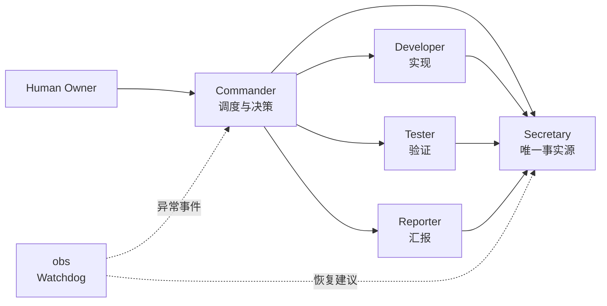
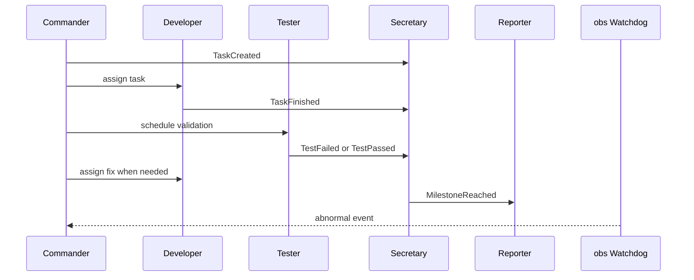

# CXWorkflow

[](#codex-插件)
[](#事件驱动模型)
[](#限流保护)
[](./README.en.md)

CXWorkflow 是一套面向 Codex 的多线程开发工作流。它不是追求“Agent 越多越强”，而是用最小必要并发，把 Codex 组织成一个可预测、可恢复、可长期运行的开发团队。

> 核心原则：CXWorkflow 优先保证可预测协作，而不是最大并发。所有角色通过事件协同，Secretary 作为唯一状态源，Commander 采用感知限流的串行接力调度模式。

## 快速开始

### 作为 Codex 插件使用

1. 克隆本仓库。
2. 在 Codex 插件管理界面中添加本地插件，插件根目录是仓库根目录：

```text
<your-local-path>/CXWorkflow
```

3. 安装完成后，新开一个 Codex 线程让插件技能加载。
4. 在新线程中输入：

```text
帮我基于当前项目创建 CXWorkflow 多线程开发团队
```

或：

```text
Help me set up a CXWorkflow Codex development team for this project.
```

### 手动使用

暂时不安装插件也可以，直接复制下方的[一键创建 Prompt](#一键创建-prompt) 到 Codex。

## 目录

- [为什么需要 CXWorkflow](#为什么需要-cxworkflow)
- [架构总览](#架构总览)
- [核心机制](#核心机制)
- [团队角色](#团队角色)
- [负载等级](#负载等级)
- [限流保护](#限流保护)
- [Codex 插件](#codex-插件)
- [一键创建 Prompt](#一键创建-prompt)
- [什么时候使用](#什么时候使用)

## 为什么需要 CXWorkflow

单个 Codex 会话适合快速问答和小型修改，但在长期项目中，它容易同时承担规划、实现、测试、记忆决策和汇报进度，最终出现上下文拥挤、状态不一致和请求过多。

CXWorkflow 的目标不是扩大并发，而是降低混乱：

| 常见误区 | CXWorkflow 的选择 |
| --- | --- |
| Agent 越多越聪明 | 最小必要并发 |
| 线程互相询问状态 | Secretary 作为唯一事实源 |
| 所有线程同时运行 | Commander 串行调度 |
| obs 持续巡检 | obs 作为 Watchdog，异常时唤醒 |
| 429 后继续重试 | 熔断、保存状态、降级恢复 |

## 架构总览



## 核心机制

### 事件驱动模型

角色只响应事件，不持续互相轮询。



| 事件 | 触发者 | 响应者 |
| --- | --- | --- |
| `TaskCreated` | Commander | Developer 读取任务并执行 |
| `TaskFinished` | Developer | Commander 安排 Tester 验证 |
| `TestFailed` | Tester | Commander 指派 Developer 修复 |
| `Blocked` | 任意线程 | Commander 决策，Secretary 记录 |
| `MilestoneReached` | Commander 或 Secretary | Reporter 生成汇报 |
| `RateLimitWarning` | 任意线程 | Commander 降低并发，obs 进入 Watchdog |

### Secretary 是唯一事实源

所有关键事件、任务状态、阻塞点、测试结果、决策和恢复动作都写入 Secretary。任何角色需要上下文时，先读 Secretary，而不是直接问其他线程。

### Commander 是唯一调度入口

Commander 决定谁在什么时候工作。Developer 和 Tester 串行接力，Reporter 与 obs 只在里程碑、阻塞或异常事件出现时介入。

### obs 是 Watchdog

obs 正常情况下休眠。只有出现以下事件时唤醒：

- 超过一段时间没有新事件
- 任务卡死或阻塞无人处理
- 连续测试失败
- 出现 429 或请求压力
- 线程职责漂移
- 上下文冲突或状态不一致

## 团队角色

| 线程 | 角色 | 主要职责 |
| --- | --- | --- |
| `指挥` / `Commander` | 项目负责人 | 拆解目标、调度线程、制定优先级和验收标准 |
| `秘书` / `Secretary` | 唯一事实源 | 记录事件、任务状态、决策、阻塞和恢复动作 |
| `开发` / `Developer` | 主工程师 | 实现功能、修复 bug、重构代码并提交验证结果 |
| `测试` / `Tester` | QA 与审查 | 运行测试、审查质量、发现回归风险 |
| `汇报` / `Reporter` | 状态汇总 | 在里程碑或用户请求时生成进度报告 |
| `obs` / `Observer` | Watchdog | 检查线程是否正常运行，发现异常后推动恢复 |

## 负载等级

默认从 Level 1 开始，只在任务复杂度、风险或持续时间需要时升级。

| 等级 | 启用角色 | 适用场景 |
| --- | --- | --- |
| Level 0 | Commander | 需求澄清、轻量规划、简单问题 |
| Level 1 | Commander + Developer | 默认模式，小型实现或修复 |
| Level 2 | Commander + Developer + Tester | 需要验证、回归检查或代码审查 |
| Level 3 | Commander + Secretary + Developer + Tester + Reporter + obs | 长期项目、多模块功能、复杂协作 |

## 限流保护

CXWorkflow 默认采用最小必要并发，降低 API 429 风险。

| 条件 | 动作 |
| --- | --- |
| 正常运行 | 串行接力，Reporter 和 obs 不轮询 |
| 1 次 `429` | Commander 降低负载等级，暂停非必要线程 |
| 连续 3 次 `429` | 停止 Reporter 和 obs，只保留 Commander 和必要执行线程 |
| 连续 5 次 `429` | Secretary 保存状态，Commander 暂停工作流，等待冷却后恢复 |

恢复流程：

1. Secretary 读取最后状态。
2. Commander 重新确认当前任务、阻塞和下一步。
3. 从较低负载等级恢复，而不是直接回到全角色并发。

## Codex 插件

本仓库包含 Codex 插件配置：

| 项目 | 路径或值 |
| --- | --- |
| 插件清单 | `.codex-plugin/plugin.json` |
| 插件名称 | `cxworkflow` |
| 显示名称 | `CXWorkflow` |
| 分类 | `Productivity` |
| 技能目录 | `skills/` |
| 工作流技能 | `skills/cxworkflow/SKILL.md` |

安装后，Codex 可以自动识别 CXWorkflow 技能，并在用户需要创建、解释或运行多线程开发团队时使用它。

## 一键创建 Prompt

<details>
<summary>展开完整 Prompt</summary>

```text
请基于当前项目一键创建 Codex 多线程开发团队，所有线程都使用当前仓库作为工作目录。

请创建并命名以下 session：

1. 指挥
职责：你是项目总指挥。读取整个项目和现有上下文，理解目标，拆分任务，制定开发路线，并向其他线程分配工作。你不直接做大量实现，优先负责决策、规划、协调和验收标准。

2. 秘书
职责：你是秘书长，也是项目唯一事实源。负责记录项目决策、任务状态、各线程进展、待办事项、阻塞点、测试结果和恢复动作。任何角色需要上下文时都应优先读取你的记录。

3. 开发
职责：你是主开发手。根据指挥线程的任务进行代码实现、bug 修复、重构和功能落地。每次修改前先理解代码结构，修改后运行必要验证，并把结果汇报给秘书和指挥。

4. 测试
职责：你是测试手和代码审查员。负责审查代码质量、运行测试、发现 bug、覆盖率缺口、架构风险和回归风险。请把问题按严重程度汇报给秘书和指挥。

5. 汇报
职责：你是汇报手。你只在里程碑、用户请求或指挥要求时生成项目进度报告，优先读取秘书状态，不要频繁轮询其他线程。

6. obs
职责：你是 Workflow Watchdog。正常情况下保持休眠。发现线程掉线、职责漂移、信息不同步、阻塞无人处理、连续测试失败、429、任务偏离目标或协作流程失效时，你要指出问题，提醒对应线程恢复职责，并向指挥和秘书给出纠偏建议，帮助团队回到正常轨道。

创建完成后，请把每个 session 的 threadId、标题和职责列出来，并尽量 pin 这些线程。
```

</details>

短版：

```text
请基于当前项目一键创建 Codex 多线程开发团队：指挥、秘书、开发、测试、汇报、obs。采用事件驱动协作，秘书作为唯一事实源，指挥负责限流感知的串行调度，obs 作为 Watchdog 在异常时纠偏恢复。创建后列出 threadId 和用途，并 pin 这些线程。
```

## 汇报格式

```md
# 项目状态

## 已完成
- ...

## 进行中
- ...

## 阻塞
- ...

## 风险
- ...

## 下一步
- ...
```

## 什么时候使用

适合：

- 项目会持续超过一个会话。
- 工作会触及多个模块或多个文件。
- 需要持续规划、编码、测试和汇报。
- 希望 Codex 像一个开发团队，而不是单个助手。
- 想控制多 Agent 协作成本和 429 风险。

不适合：

- 小型单文件修复。
- 一次性简单问答。
- 不需要测试、汇报或长期上下文的任务。
