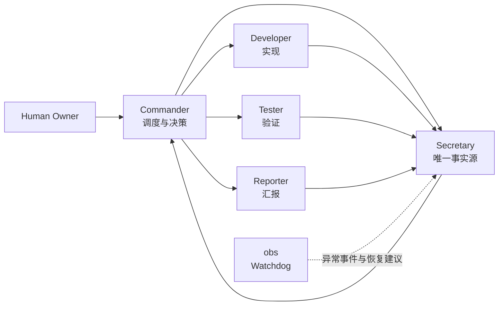
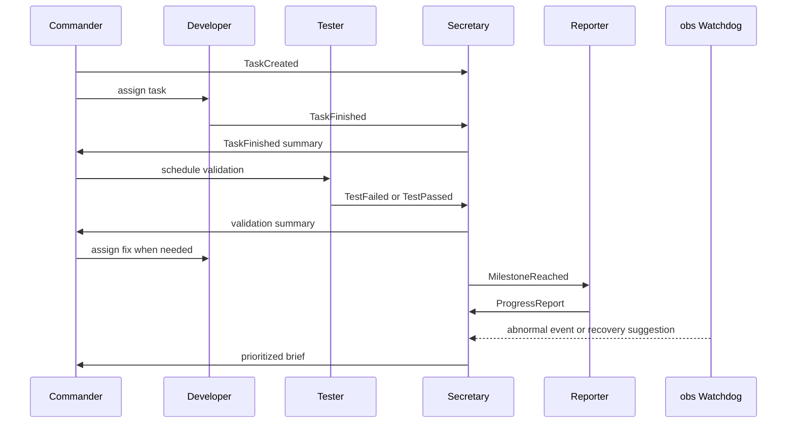

<h1 align="center">CXWorkflow</h1>

<div align="center">

[](#codex-插件)
[](#事件驱动模型)
[](#限流保护)
[](./CHANGELOG.md)
[](./README.en.md)

</div>

CXWorkflow 是一套面向 Codex 的多会话开发工作流。它不是追求”Agent 越多越强”，而是用最小必要并发，把 Codex 组织成一个可预测、可恢复、可长期运行的开发团队。

> 核心原则：CXWorkflow 优先保证可预测协作，而不是最大并发。所有角色通过事件协同，Secretary 作为唯一状态源和 Commander 收件箱，Commander 只接受 Secretary 转交的汇总消息，并采用感知限流的串行接力调度模式。

## 快速开始

### 作为 Codex 插件使用

1. 克隆本仓库。
2. 在 Codex 插件管理界面中添加本地插件，插件根目录是仓库根目录：

```text
<your-local-path>/CXWorkflow
```

3. 安装完成后，新开一个 Codex 线程让插件技能加载。
4. 在新线程中输入：

```text
帮我基于当前项目创建 CXWorkflow 多线程开发团队
```

或：

```text
Help me set up a CXWorkflow Codex development team for this project.
```

### 手动使用

暂时不安装插件也可以，直接复制下方的[一键创建 Prompt](#一键创建-prompt) 到 Codex。

## 目录

- [前置条件](#前置条件)
- [安装与更新](#安装与更新)
- [为什么需要 CXWorkflow](#为什么需要-cxworkflow)
- [架构总览](#架构总览)
- [核心机制](#核心机制)
- [秘书路由协议](#秘书路由协议)
- [团队角色](#团队角色)
- [负载等级](#负载等级)
- [限流保护](#限流保护)
- [Codex 插件](#codex-插件)
- [一键创建 Prompt](#一键创建-prompt)
- [汇报格式](#汇报格式)
- [故障排除](#故障排除)
- [什么时候使用](#什么时候使用)
- [贡献与许可](#贡献与许可)

## 前置条件

- **Codex 访问权限**：你需要有 Codex 的使用权限。
- **插件支持**：Codex 客户端需支持本地插件安装。
- **网络环境**：确保能够正常访问 Codex API（无 429 限流）。

## 安装与更新

推荐使用仓库内的稳定更新脚本，让 personal marketplace、插件源目录和 Codex 缓存保持一致：

```powershell
powershell -ExecutionPolicy Bypass -File .\scripts\update-local-plugin.ps1
```

脚本会同步插件到：

```text
%USERPROFILE%\.agents\plugins\plugins\cxworkflow
```

并确保 personal marketplace 指向这个真实源目录。更新后请新开 Codex 线程或重启 Codex，让插件技能重新加载。

更多细节见 [INSTALL.md](./INSTALL.md)。

## 为什么需要 CXWorkflow

单个 Codex 会话适合快速问答和小型修改，但在长期项目中，它容易同时承担规划、实现、测试、记忆决策和汇报进度，最终出现上下文拥挤、状态不一致和请求过多。

CXWorkflow 的目标不是扩大并发，而是降低混乱：

| 常见误区 | CXWorkflow 的选择 |
| --- | --- |
| Agent 越多越聪明 | 最小必要并发 |
| 会话互相询问状态 | Secretary 作为唯一事实源 |
| 所有会话同时运行 | Commander 串行调度 |
| obs 持续巡检 | obs 作为 Watchdog，异常时唤醒 |
| 429 后继续重试 | 熔断、保存状态、降级恢复 |

## 架构总览



## 核心机制

### 事件驱动模型

角色只响应事件，不持续互相轮询。

> *流程：Commander 创建任务 → Developer 执行并写入 Secretary → Tester 验证并写入 Secretary → Reporter 在里程碑读取 Secretary 并写回报告 → obs 发现异常后写入 Secretary → Secretary 汇总后转交 Commander。*



| 事件 | 来源 | 响应者 |
| --- | --- | --- |
| `TaskCreated` | Commander | Developer 读取任务并执行 |
| `TaskFinished` | Developer | Secretary 汇总后转交 Commander，Commander 安排 Tester 验证 |
| `TestFailed` | Tester | Secretary 汇总严重程度后转交 Commander，Commander 指派 Developer 修复 |
| `Blocked` | 任意线程 | Secretary 记录并转交 Commander 决策 |
| `MilestoneReached` | Commander 或 Secretary | Reporter 读取 Secretary 生成汇报，并把报告写回 Secretary |
| `RateLimitWarning` | 任意线程 | Secretary 汇总压力信号后转交 Commander；Commander 降低并发，obs 进入 Watchdog |

### Secretary 是唯一事实源

所有关键事件、任务状态、阻塞点、测试结果、决策和恢复动作都写入 Secretary。任何角色需要上下文时，先读 Secretary，而不是直接问其他线程。

Secretary 同时是 Commander 的唯一输入通道。测试、汇报、obs 以及其他执行线程不直接向 Commander 发送状态、告警或建议；它们先把消息汇总给 Secretary，由 Secretary 去重、分级、补齐上下文后转交 Commander。

### Commander 是唯一调度入口

Commander 决定谁在什么时候工作，但只接受 Secretary 转交的消息。Developer 和 Tester 串行接力，Reporter 与 obs 只在里程碑、阻塞或异常事件出现时介入，并把输出先写给 Secretary。这样 Commander 可以专注 plan、调度和验收标准，不被测试日志、观察告警和汇报草稿打断。

## 秘书路由协议

### 标准消息格式

所有非 Commander 线程写给 Secretary 的消息都使用固定格式，避免 Secretary 变成自由文本堆积区：

```text
Event:
Source:
Task:
Status:
Severity:
Evidence:
Suggested Next:
Needs Commander: yes/no
```

字段含义：

| 字段 | 说明 |
| --- | --- |
| `Event` | 事件类型，例如 `TaskFinished`、`TestFailed`、`Blocked`、`ProgressReport`、`RateLimitWarning` |
| `Source` | 消息来源线程，例如 Developer、Tester、Reporter、obs |
| `Task` | 关联任务或模块 |
| `Status` | 当前状态，必须简短明确 |
| `Severity` | `info`、`warning`、`blocking`、`critical` |
| `Evidence` | 测试输出、文件路径、错误摘要或可复现线索 |
| `Suggested Next` | 建议下一步，不直接调度 |
| `Needs Commander` | 只有需要 Commander 决策或改计划时才为 `yes` |

### Secretary 转交阈值

Secretary 不把所有消息都转交 Commander。只有以下情况进入 Commander 简报：

- 阻塞无法由当前角色自行解决
- 测试失败、回归风险或验收标准受影响
- 需要调整计划、优先级、范围或下一步调度
- 里程碑完成，需要 Commander 验收或安排下一阶段
- 出现 429、资源压力、线程失控或职责漂移
- 用户请求明确需要 Commander 决策

普通进度、低风险观察和汇报草稿只记录在 Secretary，不打断 Commander。

### 摘要节奏

Secretary 按事件严重度控制转交频率：

| 场景 | Secretary 动作 |
| --- | --- |
| `info` 普通进度 | 只记录，阶段结束时批量汇总 |
| `warning` 风险 | 合并同类项，在下一次检查点转交 |
| `blocking` 阻塞 | 立即转交 Commander |
| `critical` 严重问题 | 立即转交 Commander，并建议暂停相关线程 |
| 多个小事件连续出现 | 合并成一条 batch 简报 |

### 任务状态机

Secretary 维护每个任务的状态机，Commander 只看状态变化和异常：

```text
Planned -> Assigned -> Implementing -> ReadyForTest -> Testing -> Fixing -> Accepted -> Reported
```

状态规则：

| 状态 | 进入条件 |
| --- | --- |
| `Planned` | Commander 拆出任务并写入 Secretary |
| `Assigned` | Commander 指派执行线程 |
| `Implementing` | Developer 开始实现 |
| `ReadyForTest` | Developer 写入 `TaskFinished` |
| `Testing` | Tester 开始验证 |
| `Fixing` | Tester 写入 `TestFailed` 且需要修复 |
| `Accepted` | Tester 写入 `TestPassed`，Commander 或验收条件确认通过 |
| `Reported` | Reporter 读取 Secretary 并写回最终汇报 |

### obs 与 Reporter 边界

obs 只负责发现异常、提醒相关线程恢复职责、把恢复建议写给 Secretary。obs 不直接调度、不直接改计划、不直接向 Commander 施压。

Reporter 是发布层，只读取 Secretary 记录生成面向用户的进度报告。Reporter 不轮询 Developer、Tester 或 obs，也不自行解释项目真实状态。

### 收敛模式

任务进入后期时，Secretary 建议 Commander 自动降级活跃角色，避免团队越跑越吵：

| 条件 | 收敛动作 |
| --- | --- |
| Developer 完成实现 | Developer 停止主动扩展，只响应修复任务 |
| Tester 验证通过 | Tester 停止轮询，只保留复测入口 |
| Reporter 完成汇报 | Reporter 休眠到下一里程碑或用户请求 |
| 无异常事件 | obs 保持休眠 |
| 连续稳定检查点 | Commander 降低负载等级 |

### obs 是 Watchdog

obs 正常情况下休眠。只有出现以下事件时唤醒：

- 超过一段时间没有新事件
- 任务卡死或阻塞无人处理
- 连续测试失败
- 出现 429 或请求压力
- 线程职责漂移
- 上下文冲突或状态不一致

## 团队角色

| 线程 | 角色 | 主要职责 |
| --- | --- | --- |
| `指挥` / `Commander` | 项目负责人 | 拆解目标、调度线程、制定优先级和验收标准 |
| `秘书` / `Secretary` | 唯一事实源与指挥收件箱 | 记录事件、维护任务状态机、过滤消息，并向 Commander 转交必要简报 |
| `开发` / `Developer` | 主工程师 | 实现功能、修复 bug、重构代码并提交验证结果 |
| `测试` / `Tester` | QA 与审查 | 运行测试、审查质量、发现回归风险，并把结果写给 Secretary |
| `汇报` / `Reporter` | 状态汇总 | 在里程碑或用户请求时生成进度报告，并把报告写给 Secretary |
| `obs` / `Observer` | Watchdog | 检查线程是否正常运行，发现异常后把恢复建议写给 Secretary |

## 负载等级

默认从 Level 1 开始，只在任务复杂度、风险或持续时间需要时升级。

| 等级 | 活跃角色 | 适用场景 |
| --- | --- | --- |
| Level 0 | Commander | 需求澄清、轻量规划、简单问题 |
| Level 1 | Commander + Developer | 默认模式，小型实现或修复 |
| Level 2 | Commander + Developer + Tester | 需要验证、回归检查或代码审查 |
| Level 3 | Commander + Secretary + Developer + Tester + Reporter + obs | 长期项目、多模块功能、复杂协作 |

## 限流保护

CXWorkflow 默认采用最小必要并发，降低 API 429 风险。

| 条件 | 动作 |
| --- | --- |
| 正常运行 | 串行接力，Reporter 和 obs 不轮询 |
| 1 次 `429` | Commander 降低负载等级，暂停非必要线程 |
| 连续 3 次 `429` | 停止 Reporter 和 obs，只保留 Commander 和必要执行线程 |
| 连续 5 次 `429` | Secretary 保存状态，Commander 暂停工作流，等待冷却后恢复 |

恢复流程：

1. Secretary 读取最后状态。
2. Commander 重新确认当前任务、阻塞和下一步。
3. 从较低负载等级恢复，而不是直接回到全角色并发。

## Codex 插件

本仓库包含 Codex 插件配置：

| 项目 | 路径或值 |
| --- | --- |
| 插件清单 | `.codex-plugin/plugin.json` |
| 插件名称 | `cxworkflow` |
| 显示名称 | `CXWorkflow` |
| 分类 | `Productivity` |
| 技能目录 | `skills/` |
| 工作流技能 | `skills/cxworkflow/SKILL.md` |

安装后，Codex 可以自动识别 CXWorkflow 技能，并在用户需要创建、解释或运行多线程开发团队时使用它。

## 一键创建 Prompt

<details>
<summary>展开完整 Prompt</summary>

```text
请基于当前项目一键创建 Codex 多线程开发团队，所有线程都使用当前仓库作为工作目录。

请创建并命名以下 session：

1. 指挥
职责：你是项目总指挥。读取整个项目和现有上下文，理解目标，拆分任务，制定开发路线，并向其他线程分配工作。你只接受秘书转交的汇总消息，不直接接收测试、汇报、obs 或执行线程的零散状态。你不直接做大量实现，优先负责决策、规划、调度和验收标准。

2. 秘书
职责：你是秘书长，也是项目唯一事实源和指挥收件箱。负责记录项目决策、任务状态、各线程进展、待办事项、阻塞点、测试结果和恢复动作。测试、汇报、obs 和执行线程的消息都先汇总到你这里；你负责去重、分级、补齐上下文，再转交给指挥。任何角色需要上下文时都应优先读取你的记录。

3. 开发
职责：你是主开发手。根据指挥线程的任务进行代码实现、bug 修复、重构和功能落地。每次修改前先理解代码结构，修改后运行必要验证，并把结果汇报给秘书，由秘书转交给指挥。

4. 测试
职责：你是测试手和代码审查员。负责审查代码质量、运行测试、发现 bug、覆盖率缺口、架构风险和回归风险。请把问题按严重程度汇总给秘书，不要直接打断指挥；由秘书转交给指挥。

5. 汇报
职责：你是汇报手。你只在里程碑、用户请求或指挥要求时生成项目进度报告，优先读取秘书状态，不要频繁轮询其他线程。报告先写给秘书，由秘书决定是否转交给指挥。

6. obs
职责：你是 Workflow Watchdog。正常情况下保持休眠。发现线程掉线、职责漂移、信息不同步、阻塞无人处理、连续测试失败、429、任务偏离目标或协作流程失效时，你要指出问题，提醒对应线程恢复职责，并把纠偏建议汇总给秘书；由秘书转交给指挥，帮助团队回到正常轨道。

运行协议：
- 非指挥线程写给秘书时必须包含 Event、Source、Task、Status、Severity、Evidence、Suggested Next、Needs Commander。
- 秘书只在阻塞、测试失败、验收受影响、计划需调整、里程碑完成、429、资源压力、线程失控、职责漂移或用户明确需要决策时转交指挥。
- 普通进度和低风险观察只记录在秘书，按阶段或检查点批量汇总。
- 秘书维护任务状态机：Planned -> Assigned -> Implementing -> ReadyForTest -> Testing -> Fixing -> Accepted -> Reported。
- obs 只写异常和恢复建议给秘书，不直接调度或改计划。
- 汇报只读取秘书记录并把报告写回秘书，不轮询其他线程。
- 阶段后期进入收敛模式：开发停止主动扩展，测试停止轮询，汇报完成后休眠，obs 无异常则休眠。

创建完成后，请把每个 session 的 threadId、标题和职责列出来，并尽量 pin 这些线程。
```

</details>

短版：

```text
请基于当前项目一键创建 Codex 多会话开发团队：指挥、秘书、开发、测试、汇报、obs。采用事件驱动协作，秘书作为唯一事实源和指挥收件箱；指挥只接受秘书转交的汇总消息，专注 plan、调度和验收；测试、汇报、obs 的消息先用标准格式汇总给秘书，再由秘书按阈值转交给指挥。秘书维护任务状态机并在后期推动收敛模式。obs 作为 Watchdog 在异常时纠偏恢复。创建后列出 threadId 和用途，并 pin 这些线程。
```

## 汇报格式

```text
# 项目状态

## 已完成
- ...

## 进行中
- ...

## 阻塞
- ...

## 风险
- ...

## 下一步
- ...
```

## 故障排除

### 插件无法加载

1. 确认插件路径正确：在 Codex 插件管理中检查路径是否指向仓库根目录。
2. 重启 Codex：新插件安装后需要重启客户端才能加载。
3. 检查 `plugin.json`：确保 `.codex-plugin/plugin.json` 文件存在且格式正确。

### 插件重启后消失或回到旧版

这通常不是版本不兼容，而是 personal marketplace 指向的插件源目录不存在，Codex 只能临时读取旧缓存。

1. 运行稳定更新脚本：

```powershell
powershell -ExecutionPolicy Bypass -File .\scripts\update-local-plugin.ps1
```

2. 确认源目录存在：

```powershell
Test-Path "$env:USERPROFILE\.agents\plugins\plugins\cxworkflow"
```

3. 新开 Codex 线程或重启 Codex。

### 会话不响应

1. 检查事件日志：查看 Secretary 会话中的记录，确认事件是否已发出。
2. 确认 Commander 调度：Commander 负责分配任务，如果它没有发出 `TaskCreated` 事件，其他会话不会主动工作。
3. 手动触发：在对应会话中手动输入 `/cxworkflow check` 触发状态检查。

### 遇到 429 限流

1. 自动降级：CXWorkflow 会自动降低负载等级，等待冷却。
2. 手动干预：如果自动恢复失败，在 Commander 会话中输入 `/cxworkflow reset-rate-limit`。
3. 预防为主：避免在高峰时段使用 Level 3 全角色模式。

### 重置工作流

如果工作流完全卡住，可以：

1. 在 Commander 会话中输入 `/cxworkflow reset` 重置所有状态。
2. Secretary 会保留历史记录，恢复后可读取之前的上下文。

## 什么时候使用

适合：

- 项目会持续超过一个会话。
- 工作会触及多个模块或多个文件。
- 需要持续规划、编码、测试和汇报。
- 希望 Codex 像一个开发团队，而不是单个助手。
- 想控制多 Agent 协作成本和 429 风险。

不适合：

- 小型单文件修复。
- 一次性简单问答。
- 不需要测试、汇报或长期上下文的任务。

## 贡献与许可

欢迎提交 Issue 和 Pull Request。本项目采用 MIT 许可证。

---
